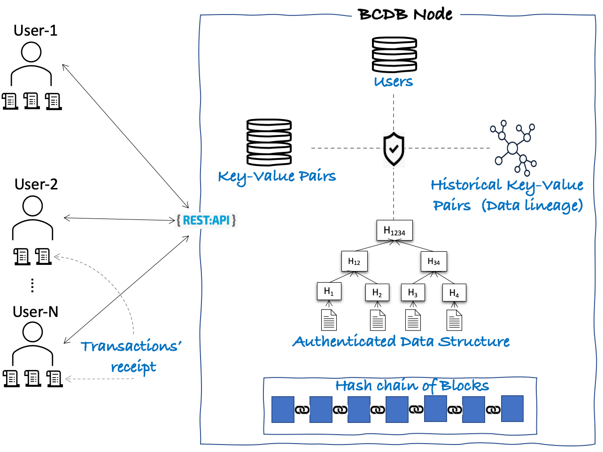

# Blockchain Database

Blockchain DB is a **key-value/document database** with certain blockchain properties such as

  - **Tamper Evident**: Data cannot be tampered with, without it going unnoticed. At any point in time, a user can request the database to provide proof for an existance of a transaction or data, and verify the same to ensure data integrity.
  - **Non-Repudiation**: A user who submitted a transaction to make changes to data cannot deny submitting the transaction later.
  - **Crypto-based Authentication**: A user that submitted a query or transaction is always authenticated using digital signature.
  - **Confidentiality and Access Control**: Each data item can have an access control list (ACL) to dictate which users can read from it and which users can write to it. Each user needs to authenticate themselves by providing their digital signature to read or write to data. Depending on the access rule defined for data, sometimes more than one users need to authenticate themselves together to read or write to data.
  - **Serialization Isolation Level**: It ensures a safe and consistent transaction execution.
  - **Provenance Queries**: All historical changes to the data are maintained separately in a persisted graph data structure so that a user can execute query on those historical changes to understand the lineage of each data item.

Blockchain DB **DOES NOT** have the following two blockchain properties:

  - **Smart-Contracts**: A set of functions that manage data on the blockchain ledger. Transactions are invocations of one or more smart contract's functions.
  - **Decentralization of Trust**: A permissioned setup of known but untrusted organizations each operating their own independent database nodes but connected together to form a blockchain network. As one node cannot trust the execution results of another node, ordering transaction must be done with a BFT protocol
  and all transactions need to be independently executed on all nodes.

## High Level Architecture
Figure 1 presents the high level architecture of Blockchain Database.

Blockchain DB stores and manages the following five data elements:

  1. **Users**: Storage of users' credentials such as digital certificate and their privileges. Only these users can access the database.
  2. **Key-Value Pairs**: Storage of all current/active key-value pairs committed by users of the database.
  3. **Historical Key-Value Pairs**: Storage of all past/inactive key-value pairs using a graph data structure with additional metadata
  such as the user who modified the key-value pair, all previous and next values of the key, transactions which have read or written to
  the key-value pair, etc... It helps to provide a complete data lineage.
  4. **Authenticated Data Structure**: Storage of Merkle Patricia Tree where leaf node is nothing but a key-value pair. It helps in
  creating proofs for the existance of a key-value pair.
  5. **Hash chain of blocks**: Storage of cryptographically linked blocks, where each block holds a set of transactions submitted
  by the user along with its commit status, summary of state changes in the form of Merkle Patricia's Root hash, etc... It helps in
  creating a proof for the existance of a block or a transaction.

The users of the database can query these five data elements provided that they have the required privileges and
also can perform transactions to modify active key-value pairs. When a user submits a transaction, user receives a transaction receipt
from the database after the commit of a block that includes the transaction. The user can then store the receipt locally for performing
client side verification of proof of existance of a key-value pair or a transaction or a block.

For a detailed architecture of the blockchain database, refer to [Detailed Architecture]()

## Use-Cases

TODO

## Build and Start a Blockchain DB Node

Refer to [setup](./docs/curl/build.md) for building the needed executables and starting a blockchain database node.

## Access the Blockchain DB Through Go-SDK

We have an [SDK](github.com/IBM-Blockchain/bcdb-sdk) built using Golang. Using APIs provided
by this SDK, a user can perform queries and transactions. Refer to the [documentation]() of the SDK
for samples and to build your first application.

## Access Blockchain DB Through REST APIs

Currently, we do not have an interactive shell to query the data and perform transaction. For now, we support REST APIs to enable users to
interact with the node. Every user who issues a `GET` or `POST` request must be authenticated cryptographically through
digital signature. To add a digital signature on the request payload, we have provided an utility called `signer`. Refer to
[signer](./docs/curl/build.md#build-and-use-signer-utility) for building the needed executables and executing the same.

Note that the SDK simplifies the developement by hiding much of the detail such as expected data format of the request payload,
signing the query and transaction, verifying the digital signature of the database node on the response, etc...
Hence, we recommend users to utilize our [SDK](github.com/IBM-Blockchain/bcdb-sdk). For learning/educational purpose, one can
use the `signer` along with the `cURL` to perform query and submit transactions.

### Queries

Let's look at queries that we execute as soon as the BDB server is started. To pretty print the JSON output, we use `jq`.
The installation steps for `jq` can be found [here](https://stedolan.github.io/jq/download/).

For each `GET` request, we need to set two custom headers called `UserID` and `Signature` which will be included in the request while sending
HTTP to the blockchain DB node.

As every user who issues a `GET` or `POST` request must be authenticated cryptographically through digital signature, the submitting user must
compute a signature on the query data or transaction data and set the signature in the `Signature` header. We use the [`signer`](./docs/curl/build.md#build-and-use-signer-utility) utility to
compute the required digital signature.

Queries can be used to fetch data stored/managed by the database. For example, we can perform the following:

  1. [Querying the configuration](./docs/curl/query.md#querying-the-cluster-configuration)
  2. [Querying a user information/credentials/privileges](./docs/curl/query.md#querying-the-user-information)
  3. [Checking the existance of a database](./docs/curl/query.md#checking-the-database-existance)
  4. [Querying data](./docs/curl/datatx.md#checking-the-existence-of-the-state)
  5. [Querying provenance of data or user](./docs/curl/provenance.md)
  6. [Querying a block](./docs/curl/query.md#querying-a-block-header)
  7. [Querying a transaction receipt for async transactions](./docs/curl/ledger.md#transaction-receipt-query)
  8. [Querying proof of existence of a transaction](./docs/curl/ledger.md#transaction-proof-query)
  9. [Querying proof of existence of data](./docs/curl/ledger.md#state-proof-query)

Error cases are discussed in [queries resulting in errors](./docs/curl/errors.md)

### Transactions

We support four types of transactions:

  1. [Database administration transaction](docs/curl/dbtx.md)
    - for creating and deleting databases.
  2. [User administration transaction](docs/curl/usertx.md)
    - for adding, deleting, updating users' credentials and privileges.
  3. [Data transaction](docs/curl/datatx.md)
    - for adding, deleting, updating the blockchain states, i.e., active key-value pairs.
  4. [Cluser configuration transaction](docs/curl/configtx.md)
    - for adding, deleting, updating nodes' and admins' configuration.

### Proofs

We support three kinds of proofs:
- Proof of ledger connectivity and block existence in ledger.
- Proof of transaction TxID been part of block N.
- Proof of state - at the end of a specific block N the value of given key K was equal to X.

Detailed explanation about these kinds of proofs can be found [here](docs/proofs/Proofs.md)

## How to Contribute

TODO

## Community Mailing List & Rocket Chat

TODO
