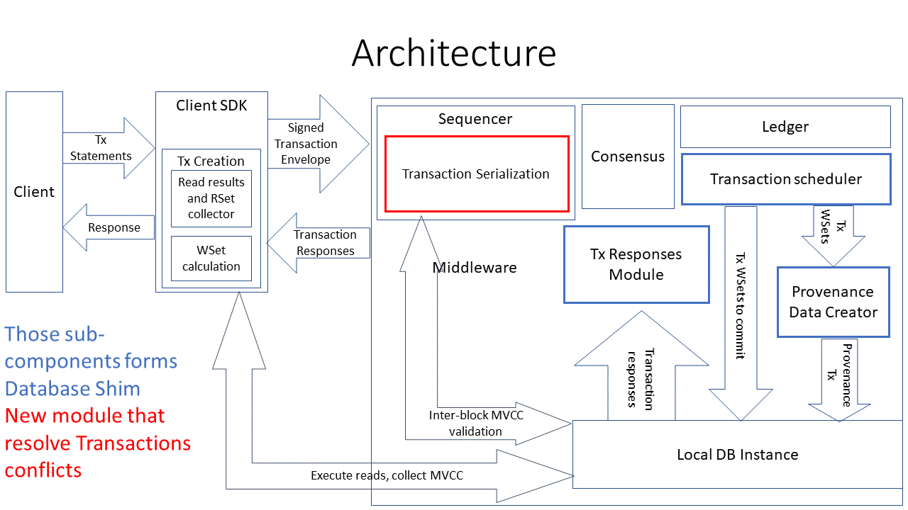
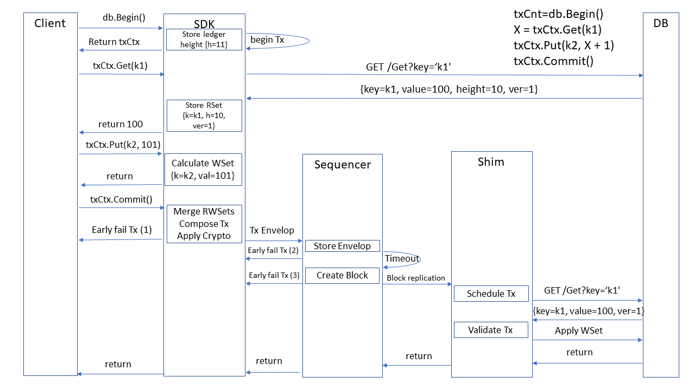
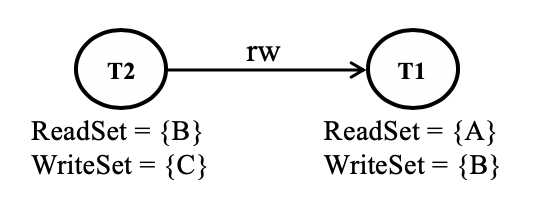
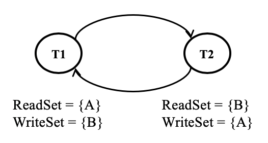
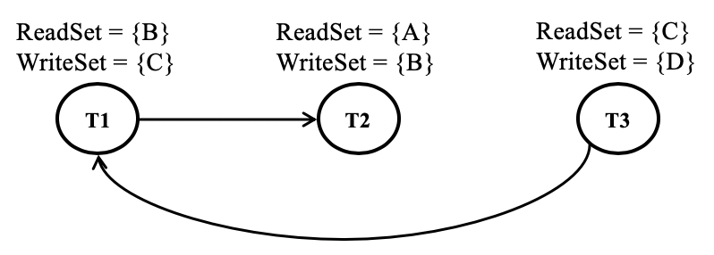
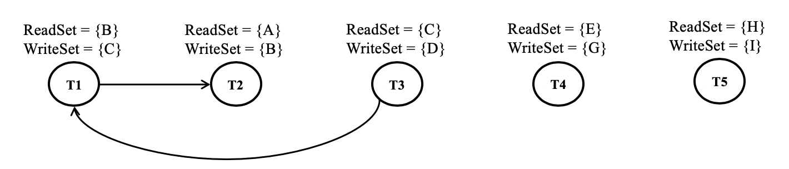
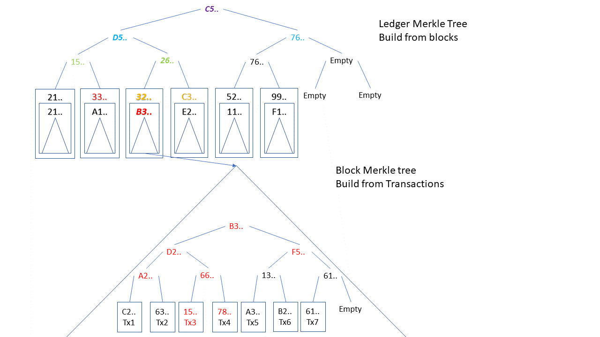

# This is proposed design of Blockchain based Database



## Assumptions:

- During PoC we expose a KV store APIs from the blockchain database.
    - SQL store APIs and Document store APIs will be exposed at post-PoC stage
- All API access from the client to the blockchain DB is synchronous as most existing databases support synchronous APIs. Further, it is hard to write an application using asynchronous database APIs. Having said that, we can also support asynchronous APIs but not considered in this doc. 
- We support multy-statements transactions at PoC phase

## Transaction Flow

The transaction flow in the above-proposed blockchain database consists of the following 8 steps. Not all those steps will be implemented at PoC phase. 



### Transaction creation/execution

Transaction creation/execution done in Client SDK and includes following steps
- Creation Transaction Context during ```db.Begin()``` call 
- Sending statement(s) from Client to Client SDK
- Collecting RSets and MVCC data for each ```txCtx.Get()``` call
- Calculating WSets for each ```txCtx.Put()``` call
- Composing all this data to transaction
- Passing result Tx to Sequencer
- When an Sequencer receives a transaction envelope, it needs to check whether the signer is a member of the blockchain DB. When the envelope is signed by the valid signer, the transaction would be added to a queue. 

Transaction Isolation algorithm is part of Transaction creation/execution process
- MVCC version for each key is composed from ledger height (block number) and Tx number, same as Fabric
- During creation Tx context - ```db.Begin()``` call, ledger height (last known block number) is stored as part of context
- During each ```txCtx.Get()``` call inside Transaction, RSet version validated again ledger height stored in context
  - If block number in version is bigger that stored in context, Tx marked as invalid and will fail during call to ```txCtx.Commit()```
  - We will not fail during after ```txCtx.Get()``` call not to mess with client side logic
  - In diagram it marked as ```Early Fail Tx (1)```

Same check should run during Transaction Serialization stage as well, but for latest known ledger height, before adding transaction to dependency graph
- In case of MAXIMIZE_PARALLEL_VALIDATION serialization, the check should be executed upon block finalising
- In diagram it marked as ```Early Fail Tx (2)```

### Early Transaction Serialization

- At the block timeout, the leader node would pick the next batch of transactions to be included in the next block. The leader can pick using one the following option provided by the user:
  1. FIFO_ORDER -- fair to all clients
  2. REORDER_FOR_CONFLICT_REDUCTION  -- trading fairness for the performance
  3. MAXIMIZE_PARALLEL_VALIDATION -- trading fairness for the performance

#### FIFO_ORDER

To construct the next block, the leader node would dequeue transactions from the txqueue till either the block size limit is reached, or the txqueue has become empty. In the same dequeued order, the transaction would be added to the block. Here, there is no unfairness to clients.

#### REORDER_FOR_CONFLICT_REDUCTION

Similar to the FIFO_ORDER, the leader would dequeue transaction from txqueue. However, before putting these transactions into a block, it does reorder them based on the dependency to reduce the validation failures. Towards achieving this, we define a _rw-dependency rule_:

**_rw-dependency rule_**
- If Ti writes a version of some state and Tj reads the previous version of that state, then we add a _rw-depdendency_ edge from Tj to Ti to denote that the transaction Ti must be validated and committed only after validating/committing the transaction Tj.

For example, let’s take two transactions T1 and T2:
<pre><code>T1: ReadSet = {A} WriteSet = {B}
T2: ReadSet = {B} WriteSet = {C}</code></pre>

Assume that both T1 and T2 are present in the txqueue. There is a rw-dependency between T1 and T2 because T1 writes B while T2 reads B. Hence, we would add a rw-dependency edge from T2 to T1. 


**Why are we doing so?**

If T1 commits first, the T2 would be aborted due to change in the read version of B. However, if T2 commits first, T1 would not be aborted. Hence, we have added an edge from T2 to T1 to denote that T2 must come first in the block ordering before T1 so that we can reduce the number of aborted transactions.

**Topological Sort**

Once we have constructed a directed dependency graph for a bunch of transactions which are dequeued from the txqueue, we need to run the topological sort on them to find the ordering of transactions to be included in the block to reduce the conflict rates. However, if the directed dependency graph has a cycle, we cannot run topological sorting. Hence, first, we need to detect all occurrences of cycles and remove transactions to break it. 

Let’s look at some examples:

_Example 1:_
<pre><code>T1: ReadSet = {A} WriteSet = {B}
T2: ReadSet = {B} WriteSet = {A}</code></pre>

As per our rw-dependency rule, we would get a cycle in the dependency graph as shown below.



When a cycle occurs, it means that only either of the transaction can become valid. Further, we cannot run topology sort when the graph has a cycle. Hence, we need to break the cycle by aborting a transaction. ```Early Fail Tx (3)``` in diagram.

_Example 2:_
<pre><code>T1: ReadSet = {B} WriteSet = {C}
T2: ReadSet = {A} WriteSet = {B}
T3: ReadSet = {C} WriteSet = {D}</code></pre>

The dependency graph for the above set of transactions is shown below:



When we add transactions to a block, if we aren't reordering them and instead storing it in the FIFO order, i.e., T1, T2, T3, the transaction T3 would get invalidated by the block processor for sure as the read version of key C would be different from the committed version given that T1 is committed and updated the key C. However, if we run the topology sorting on the dependency graph, we would get T3, T2, and T2 as the order. If we include the transactions in that order in the block, all three transactions would go through (assuming that the committed state is still same as the one read by these transactions). 

#### MAXIMIZE_PARALLEL_VALIDATION

In both FIFO_ORDER and REORDER_FOR_CONFLICT_REDUCTION, the block processor still needs to validate transaction serially as there is still a dependency between these transactions. However, if we include only non-dependent transactions within a block, the block processor can validate and commit all transactions in parallel. 

Let's look at an example:
<pre><code>T1: ReadSet = {B} WriteSet = {C}
T2: ReadSet = {A} WriteSet = {B}
T3: ReadSet = {C} WriteSet = {D}
T4: ReadSet = {E} WriteSet = {G}
T5: ReadSet = {H} WriteSet = {I}</code></pre>

The dependency graph for all these five transactions are shown below.



If we decide to either defer T1 or abort T1 early, we can blindly include the rest of the transactions T2, T3, T4, and T5 in any order in the block. The block processor can validate and commit these transactions parallely. 

We can also have a mix of dependent transactions and non-dependent transactions in a block to ensure that we reach the block size limit. As a result, our typical block would look like
<pre><code>PARALLEL_VALIDATION { 
  SERIAL_VALIDATION{T1, T2, T3}
  SERIAL_VALIDATION{T7, T9, T11}
  T4,
  T5,
  T6,
  T8,
  T10
}</code></pre>

As a result, the block processor can validate these rows of transaction parallely. Within a row, if there are many transaction with an identifier SERIAL_VALIDATION, then those transactions have to be validated serially. In other words, the block processor would first validate T1, T7, T4, T5, T6, T8, T10 in parallel. Once T1 is validated, the block processor would validate T2 immediately. Similarly, once T7 is validated, the block processor would validate T9 immediately. The same logic is applicable for T3 and T11. 

While there is fairness in FIFO_ORDER, in REORDER_FOR_CONFLICT_REDUCTION and MAXIMIZE_PARALLEL_VALIDATION, we tradeoff fairness with performance.

**Final remark** - to reduce amount of inter-block conflicts, block transactions RSets re-checked before block creation (before serialization) and block pipelining will be disabled (at least, for PoC), i.e. new block will start to form in leader only after previous block was applied to local database 
### Consensus and block distribution
Once a block is created, consensus would be executed across nodes. Once the majority of the nodes agree on the created block (as per the employed consensus algorithm), the block would be added to the block queue. 

**From this point all operations executed sequentially on each network node, not only on Sequencer** 

### Appending the Block to Block Store
- As the block store is the source of truth, we maintain it in the file system similar to what Fabric v0.6 and v2.0 do. We can copy the block store code from the Fabric v2.0. 
- Although Sequencer remove transaction conflicts, at least for REORDER_FOR_CONFLICT_REDUCTION and MAXIMIZE_PARALLEL_VALIDATION, so transaction should not fail during validation of RWSets and MVCC, but in byzantine environment we can have malicious leader and we need to store transaction status (OK/FAIL) after performing transaction execution
  - For FIFO_ORDER, we should do it in CFT as well.

### Transactions scheduling
- Transaction scheduler tried to block transactions for parallel validation/execution
  - For MAXIMIZE_PARALLEL_VALIDATION, Transactions already arranged in blocks for parallel execution
  - For REORDER_FOR_CONFLICT_REDUCTION, _rw_ dependency graph for transaction in block is build and transaction executed based on BFS order
  - For FIFO_ORDER, because _rw_ dependency graph may contain cycles, much simpler algorithm used
    - Tx in block passed one by one, checking for access to same data entries
    - Once suspect to any conflict appear, already accumulated (passed) Tx are sent to Executor and new Tx accumulation is started
 

### Provenance data creation and data integrity proofs
At PoC phase, we will store provenance data in KV Store, as rest of the blockchaindb data

Provenance data structure:
- After Tx validation/execution, Provenance data Tx created from its RWSet. 
  - This is done to add transaction execution status to provenance data.
- For each entry in WSet, tuple ```{Key, newValue, BlockTime, BlockNumber, TxTime, TxId, ClientId, IsDelete, IsOk}``` added to database
  - Key will be combination of ```Key || TxId```
  - This data should be indexed by ```Key || BlockTime``` and ```Key || TxTime```, to search by ```Key``` and time
- In addition, we will create reverse index that maps ```TxId``` to ```BlockNumber```  
  - To easy find block that contains specific transaction
  


The data in tuple used to create cryptographic proof:
- ```TxId``` used to validate that transaction is part of block identified by ```BlockNumber```
  - We assume that transactions stored in block as Merkle Tree and based on this is is easy to generate cryptographic proof that transaction with current ```TxId``` is part of block
    - For example, to prove that ```Tx3``` is part of block Merkle tree with root B3.. , we need Tx3, its hash – 15.. and 78.. (hash of sibling transaction),  A2.. (sibling in Merkle tree), F5.. (sibling in Merkle tree).
- In addition, like QLDB, we will build a continuously updating Merkle tree of ledger blocks     
  - This tree will be used to generate proof that block is part of ledger
  - To provide proof that block with Merkle root B3.. is part of ledger, we provide:
   33.. (previous block hash), C3.. (next block hash), 15.. (sibling in Merkle tree), 76.. (sibling in Merkle tree) – more or less same procedure as proof for Tx in block
- So, at the end, as proof, we provide Tx hash, siblings in block Merkle tree until root, prev block hash, next block hash, siblings in ledger Merkle tree until root
  - For all entities with signatures, like Tx, Block, we will provide signatures as well

- If we want to store more that one Merkle tree inside block, for example, to store all state changes in block, it is really simple to provide proofs for leaf in any of Merkle trees
  - Lets mark root of Tx Merkle tree as TxTreeRoot and root of state changes Merkle tree as StateTreeRoot
  - We store hash of TxTreeRoot||StateTreeRoot in block header, along/instead of TxTreeRoot and StateTreeRoot. Lets call it as MergedTreeRoot. This way we _merged_ both Merkle trees
    - This way we can add any numbers of Merkle trees inside block, if we need
  - To calculate block hash, we use PrevBlockHash||MergedTreeRoot
  - To provide proof for transaction, we add StateTreeRoot in list of provided hashes before PrevBlockHash, to calculate MergedTreeRoot
  - To provide proof for state change, we add TxTreeRoot in list of provided hashes before PrevBlockHash, to calculate MergedTreeRoot

[Proof check example](PROOF.md)  

**Final remark** - because we need ledger Merkle tree root for validations, we can return it, along with ledger height, as response to commit
### Transaction validation/commit
Basic assumption is no conflicting transactions send to be validated/committed in parallel
- We revalidate Tx RSet correctness, by reading same values again and checking MVCC values
- For database that support WSet apply, we just apply WSet
- For database that not support WSet apply, we just execute Put statements in transaction, one by one 

### Handling responses
We have multiple network nodes that commit transactions. Some ot the nodes may fail, become byzantine, so how we should handle node responses to transaction
- Each node that sends response to SDK, should sign this response.
- SDK collect required number of responses, defined in ```TxOptions``` - per transaction or ```DBOptions``` - for database and only after that pass result of transaction execution to client
  - For KV Store, only OK/FAIL responses are possible 

We define multiple policies to handle responses
- MAJORITY - more that 2/3*N nodes responded with same result
- MIN_BFT - more that 1/3*N + 1 nodes responded with same result
- MIN - just one node responded

