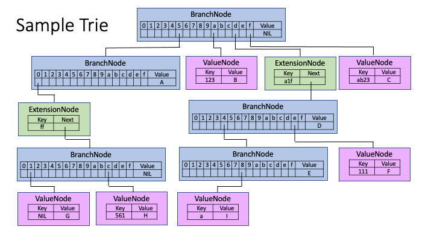
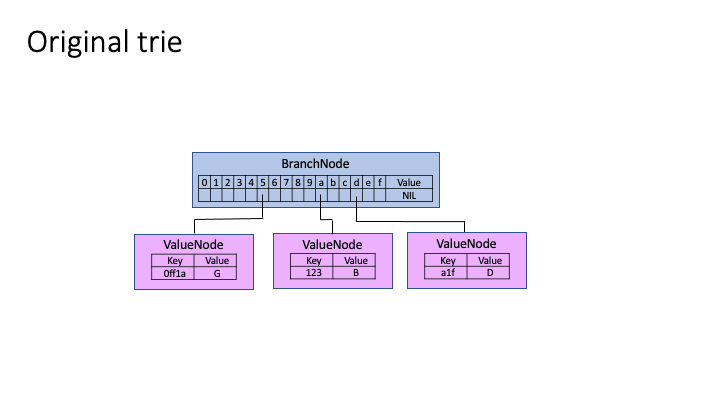
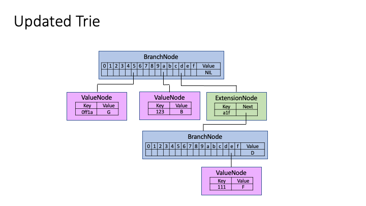

## Merkle-Patricia Trie

The Merkle-Patricia trie is a combination of two tree data structures:
* Merkle tree – a tree that uses child hashes instead of pointers
* Patricia trie – an optimized dictionary tree

### Patricia trie
The main difference between a Patricia trie and a regular dictionary tree is the algorithm used to compress long one-child branches into a single node.


Different implementations contain between two and three types of different nodes, but there are two important types:
* Branch node – this node has more than one child and contains the list children[ALPHABET_SIZE] of children pointers.
* Extension node – this non-leaf node represents a sequence of nodes that has only one child and contains a key that represents all these nodes as one.

An _Optional third type_ of node is the Value node. This leaf node is similar to the Extension node, but instead of a pointer to the next node, it contains value.
    * Some implementations combine Extension and Value nodes into single node type.


#### Trie example

The following figure shows a sample trie with all possible types of inter-trie connections and contains the following data:
* 5        -> A
* A123     -> B
* FAB23    -> C
* DA1F     -> D
* DA1F4    -> E
* DA1F111  -> F
* 50FF1    -> G
* 50FFC561 -> H
* DA1F48A  -> I



### Trie update algorithm

* If a node with an updated key exists, just update Value and all hash pointers up to the root.
* If such a node doesn't exist, traverse trie for all key matching nodes.
    * If the last matching node is Value node:
        * Convert it to an ExtensionNode followed by BranchNode and add a new ValueNode with the remaining path, without the first character.
    * If the last matching node is Branch node, find the next node, pointed to by _node.Children[nibble]_:
        * When the next node is an NIL, replace it with a new ValueNode with the remaining path.
        * When the next node is a ValueNode, add an ExtensionNode with matching path, followed by a BranchNode, and make the new BranchNode point to the original ValueNode with the rest of its path and a new ValueNode.
        * When the next node is an ExtensionNode, add another ExtensionNode with common path and create a new BranchNode that points to the original ExtensionNode and a new ValueNode.
    * Update all hashes up to the root.

### Trie update example
This example illustrates how one update can affect multiple nodes in trie, not mention hashes in the whole branch.

We start from a trie that contains only three Value nodes, with three values:
* A123 -> B
* DA1F -> D
* 50FF1A -> G




After the insert of (DA1FE111 -> F), we see three new nodes - one Extension node, one Branch node that replaced the Value node holding value (D), and one Value node that holds the new value (F).



### Trie value delete

We just mark the node that contains the deleted value with the tombstone bit - `isDeleted` flag. Thus value delete is the same as the value update, while `isDeleted` changes instead of value. Because this flag affects the node hash, it is tamper resistant.

### Trie proofs

First, lets define the path from the trie root to the value. It's an ordered list of nodes from the root node to the Value node or the Branch node that actually contains value.

Each node in the path is represented as a list of byte arrays. Each byte array can be a hash of child node(s) (branch node, extension node) or a part of a key (extension node, value node). In addition, in our implementation, no actual value is stored in the node, but only the hash of the `<key, value>` pair. The `isDeleted` tombstone bit is represented as a separate byte array as well.

Proof generation:
- Arguments are block number and key (in our case db+key).
    - As an optional argument, `isDeleted` can be passed too.
- The server loads a snapshot of MPTrie at the time of block `N` 
- The server looks for a path that contains `key`.
    - If a path exists, it's returned to the user in the form of a list of byte arrays.

Proof validation:
- Hash of `<key, value>` pair calculated and marked as `current hash`
- Validation starts from leaf node.
- For each node in a path, check if any of the byte array in the list represents a node equal to `current hash`.
    - If no such byte array exists, the validation fails, resulting in user exit.
    - Calculate node hash by concatenating all byte arrays in the list and hashing result.
    - Make node hash new `current hash`.
- For last node in path, check that its hash equals the trie root hash stored in block header.

### BCDB implementation details

The server keeps dynamically updating the state trie. Its root is stored as part of the block header. Once the block is committed to the block store, all block transactions applied to trie and all changes (deltas) to trie are stored in the associated trie store.

The server-side implementation is composed of two parts - one is the MPTrie structure and the other is the trie store.

`MPTrie` implements all trie logic, like adding/updating/deleting values.

Trie `Store` stores all nodes in underlying storage. `nodePtr` and `valuePrt` are basically node hash and `<db, key, value>` tuple hash.

Both structures operate `TrieNode`. Each type of node exposes its `Hash` and `[][]byte` array of all inside hashes used to calculate node hash.
```go
type TrieNode interface {
	hash() ([]byte, error)
	bytes() [][]byte
}
```

`Trie` API:
```go
// NewTrie creates new Merkle-Patricia Trie, with backend store.
// If root node Hash is not nil, root node loaded from store, otherwise, empty trie is created
func NewTrie(rootHash []byte, store Store) (*MPTrie, error)
// Calculates trie hash, actually, it is root node hash
func (t *MPTrie) Hash() ([]byte, error)
// Get returns value associated with key
func (t *MPTrie) Get(key []byte) ([]byte, error)
// Update key value
func (t *MPTrie) Update(key, value []byte) error
// Delete key
func (t *MPTrie) Delete(key []byte) ([]byte, error)
// GetProof calculates proof (path) from node contains value to root node in trie
// for given key and delete flag, i.e. if value was deleted, but delete flag id false,
// no proof will be calculated
func (t *MPTrie) GetProof(key []byte, isDeleted bool) (*state.Proof, error)

type Proof struct {
    // For each node in trie path, it contains bytes of all node fields and []byte{1} in case of deleted flag true
    // Path is from rom node contains value to root node
    // Exactly same byte slices used to calculate node hash.
    Path []*types.MPTrieProofElement
}

func (p *Proof) Verify(leafHash, rootHash []byte, isDeleted bool) (bool, error)
```

Trie `Store` API:
```go

// Trie store 
type Store interface {
	// GetNode returns TrieNode associated with key/ptr. It may be temporal node
	// created by PutNode, node market to persist after PersistNode or after executing
	// CommitPersistChanges actually stored in backend storage node
	GetNode(nodePtr []byte) (TrieNode, error)
	// GetValue return value bytes associated with value ptr. Same logic as in GetNode applies.
	GetValue(valuePtr []byte) ([]byte, error)
	// PutNode store node data it temporal way - it my be accessed by GetNode, but will not stored in backend store.
	PutNode(nodePtr []byte, node TrieNode) error
	// PutValue do the same as PutNode, but for value
	PutValue(valuePtr, value []byte) error
	// PersistNode mark temporal node to be persisted to backend storage in next call to CommitPersistChanges
	PersistNode(nodePtr []byte) (bool, error)
	// PersistValue do same as PersistNode, but for value
	PersistValue(valuePtr []byte) (bool, error)
	// Height returns number of last block trie was persist for
	Height() (uint64, error)
	// CommitChanges frees all inMemory nodes and actually stores nodes and value marked to be persist by
	// PersistNode and PersistValue in single backend store update - usually used with block number
	CommitChanges(blockNum uint64) error
	// RollbackChanges free all in memory nodes and nodes marked to be persist, without storing anything in
	// underlying database. Operation can cause to current MPTrie become invalid, so always reload trie
	// after the call
	RollbackChanges() error
}
```