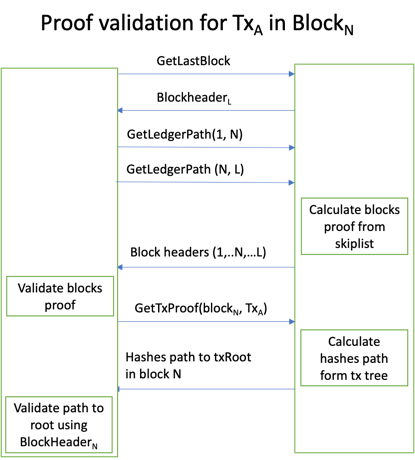

## Ledger Data and Cryptographical Proofs
The ledger API gives the user access to the data stored in Orion ledger and is used to prove data integrity and provide tamper resistance and non-repudiation.
For more information about data structures exposed by the ledger, see [block skip chain](../../architecture-and-design/block-skip-chain), [Transactions merkle tree](../../architecture-and-design/tx-merkle-tree), and [state trie](../../architecture-and-design/state-merkle-patricia-tree).

The ledger API give users detailed access to ledger data and integrity proofs, including:

- block header data
- proof of transaction existence in block 
- proof of block(s) existence in ledger 
- proof of specific db `key->value` existence at specific (block) time 
- receipt for specific tx

There are multiple ways to access ledger data, including proofs. First, there are multiple SDKs (including GO, for details see [here](gosdk/ledger))
and the REST API that can expose access to the server. For details, see [here](curl/ledger).

Based on provenance and ledger APIs, we can check:

- ledger integrity, by accessing block headers and validating the consistency of the ledger skip list
- transaction existence proof, composed of the Merkle tree path to the transaction in the block and the block existence proof: `GetTransactionProof()` and `GetLedgerPath()`
- block existence proof, from TxReceipt or by accessing block headers and validating the consistency of the ledger skip list
- proof of active and past states, by `GetStateProof()` proving existence of all state changes

### Detailed proofs
The block proof contains a connected list of blocks from the end block to the start block.
```protobuf
message GetLedgerPathResponse {
  ResponseHeader header = 1;
  repeated BlockHeader block_headers = 2;
}
```
The transaction proof contains the path in the Merkle tree in the block to the root.
```protobuf
message GetTxProofResponse {
  ResponseHeader header = 1;
  repeated bytes hashes = 2;
}
```
The state proof contains the path in the block Merkle-Patricia trie from the leaf (key,value) to the root.
```protobuf
message GetDataProofResponse {
  ResponseHeader header = 1;
  repeated MPTrieProofElement path = 2;
}

message MPTrieProofElement {
  repeated bytes hashes = 1;
}
```

### Proofs

#### Ledger connectivity proof
Proof generation:

1. Alice is provided with a receipt (block header) from Bob who claimד that some block is part of the ledger.
2. Alice requests from the server the header of the last block in the ledger, without revealing to the server which block she wants to validate. 
   - She can store the genesis block a-priori or request it as well.
3. Alice requests the shortest path in the skip list from the block she validates to the genesis block.
4. Alice requests the shortest path from the last block of the ledger (2) to the block she validates
5. Alice validates all a-priori known headers - genesis, block, last - in both paths and concatenates both paths; the result is the block proof.

To check the proof validity for each block header in the proof starting from the genesis block, Alice executes the following steps:
 
1. She calculates the block header hash.
2. If the calculated hash is in the next block header skip-list hash list, continue.
3. If not, fail.

Optimization - because the result of each call to `Commit()` is a transaction receipt containing a block header, the user can use this header if it has a higher block number than the block he wants to validate, thus avoiding the need to ask the server for the last block.

Please note that the algorithm above allows the user to build proofs from multiple blocks.
For example, proof for blocks 3 and 5 will include (8, 6, 5, 4, 3, 2, 0). It is useful while validating specific value history.

The above algorithm is used as the first step of the [transaction proof](#transaction-existence-proof)/[state proof](#state-proof) to prove that block(s) is/are part of the ledger.


#### Transaction existence proof
Here is a detailed explanation of the transaction existence proof, based on data stored during the tx commit.

- Alice submits a tx and in the future should be able to prove its existence:
- During the transaction commit, `TxReceipt` containing the block header is returned as proof.
    - The transaction content and `TxReceipt` are stored by Alice to use as proof to other users in the future.
- At some point in the future, Alice needs to prove (to Bob) that tx is part of the ledger, using the proof stored since the tx commit.
    - Alice provides Bob with `TxReceipt`, signed by the server, and the transaction content, signed by Alice.
    - First, Bob checks ledger connectivity and that the block header in `TxReceipt` is part of the ledger, as described [here](#ledger-connectivity-proof).
    - Second, Bob calls `GetTxProof()` for the tx path in the block Merkle tree and the tx content already provided by Alice.
    - Bob validates the proof using the tx hash and Merkle root stored in the block header. For more details, see [here](../../architecture-and-design/tx-merkle-tree#merkle-tree-proof-example). 



#### State proof
Here is a detailed explanation of the historical state proof, based on data stored in Merkle-Patricia Trie.

- Alice wants to get cryptographic proof from the server that that key `K` was associated with value `X` at the end of block `N`.
- Alice asks the server to `BlockHeader` for block `N`.
- As described [here](#ledger-connectivity-proof), Alice checks ledger connectivity and that the block header `N` is part of the ledger.
- Alice calls to `GetDataProof()` and verifies it:
  - Calculates hash of `<db, key, value>` tuple by calling `ConstructCompositeKey` and `CalculateKeyValueHash`
  - Call to `proof.Verify()`

