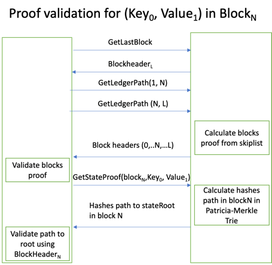

## Ledger Data and Cryptographical Proofs
Ledger API give user access to ledger data and integrity proofs
- block header data 
- transaction existence in block proof
- block(s) existence in ledger proof 
- specific db `key->value` existence at specific (block) time proof
- receipt for specific tx

There are multiple ways to access ledger data, including proofs. First, there are multiple sdks, including GO, for details see [here](https://github.com/IBM-Blockchain/bcdb-sdk/tree/main/docs/ledger.md)
and REST API to exposed by server. For details see [here](../curl/ledger.md)

Based on Provenance and Ledger APIs, we can check 
- ledger integrity by accessing block headers and validating consistency of ledger skip list
- transaction existence proof composed of merkle tree path to transaction in block and block existence proof: `GetTransactionProof()` and `GetLedgerPath()` 
- block existence proof from TxReceipt or by accessing block headers and validating consistency of ledger skip list
- proof of active and past states can be done by `GetStateProof()` proving existence of all state changes

### Block header data 
A block is a collection of ordered transactions in blockchain database. The header object within a block holds the block number,
root hash of the transaction merkle tree, root hash of the state merkle tree, and validation information. Except to transactions themselves, rest of the data is 
stored in block header. 

As mentioned above, block header contains all data required to prove existence of transaction or/and specific state at block time, 
in addition to ledger connectivity (block existence) proofs
- Block number
- List of hashes (pointers) in ledger skip chain
- Block time
- Two merkle tree roots
  - Transactions merkle tree root - for more explanation about non-repudiation and immutability proofs see [here](../proofs/Merkle-tree.md)
  - DB state merkle-patricia trie root - ethereum style, for full trie explanation see [here](./State-Trie.md)
- Validation info for all block transactions.

```protobuf
// BlockHeaderBase holds the block metadata and the chain information
// that computed before transaction validation
message BlockHeaderBase {
  uint64 number = 1;
  // Hash of (number - 1) BlockHeaderBase
  bytes previous_base_header_hash = 2;
  // Hash of BlockHeader of last block already committed to ledger
  bytes last_committed_block_hash = 3;
  // Number of last block already committed to ledger
  uint64 last_committed_block_num = 4;
}

// BlockHeader holds, in addition to base header, rest of chain information that computed after transactions validation, 
// including state and transaction merkle trees roots, skip-chain hashes and transaction validation info
message BlockHeader {
  BlockHeaderBase base_header = 1;
  // Skip chain hashed, based of BlockHeader hashed of blocks connected in blocks skip list
  repeated bytes skipchain_hashes = 2;
  // Root of Merkle tree that contains all transactions, including validation data
  bytes tx_merkel_tree_root_hash = 3;
  // Root hash of system wide state merkle-particia tree
  bytes state_merkel_tree_root_hash = 4;
  // Validation info for transactions in block.
  repeated ValidationInfo validation_info = 5;
}
```

### Detailed proofs
Block proof contains connected list of blocks from end block to start block
```protobuf
message GetLedgerPathResponse {
  ResponseHeader header = 1;
  repeated BlockHeader block_headers = 2;
}
```
Transaction proof contains path in merkle tree in the block to the root.
```protobuf
message GetTxProofResponse {
  ResponseHeader header = 1;
  repeated bytes hashes = 2;
}
```
State proof contains path in block merkle-patricia trie from leaf (key,value) to the root.
```protobuf
message GetDataProofResponse {
  ResponseHeader header = 1;
  repeated MPTrieProofElement path = 2;
}

message MPTrieProofElement {
  repeated bytes hashes = 1;
}
```
#### Ledger connectivity proof
For detailed ledger connectivity proof generate and verification see [here](./skip-chain.md#proof-generation-and-validation-algorithm) 

#### Transaction existence proof
Detailed explanation for transaction existence proof, based on data stored during tx commit
Alice submit tx and in the future should prove it existence:
- During transaction commit, `TxReceipt`, containing block header returned as proof.
  - Transaction content and `TxReceipt` stored by Alice to use as proof to another users in the future.
- At some point in future Alice need to prove (to Bob) that tx is part of ledger, using proof stored since tx commit
  - Alice provides Bob with `TxReceipt` and transaction content.
  - First, Bob checks ledger connectivity and that block header in `TxReceipt` is part of ledger, as described [here](./skip-chain.md#proof-generation-and-validation-algorithm) 
  - Second, Bob calls `GetTxProof()` for tx path in the block merkle tree and tx content already provided by Alice
  - Bob validates proof using tx hash and merkle root stored in block header, for more details see [here](./Merkle-tree.md#merkle-tree-proof-example)
  


#### State proof
Detailed explanation for historical state proof, based on data stored in Merkle-Patricia Trie.
Alice wants to get cryptographic proof from server that that key `K` was associated with value `X` at the end of block `N`.
- Alice asks server to `BlockHeader` for block `N`.
- As described in [here](./skip-chain.md#proof-generation-and-validation-algorithm), Alice checks ledger connectivity and that block header `N` is part of ledger.
- Alice calls to `GetDataProof()` and verify it.
  - Calculates hash of `<db, key, value>` tuple by calling `ConstructCompositeKey` and `CalculateKeyValueHash`
  - Call to `proof.Verify()`

